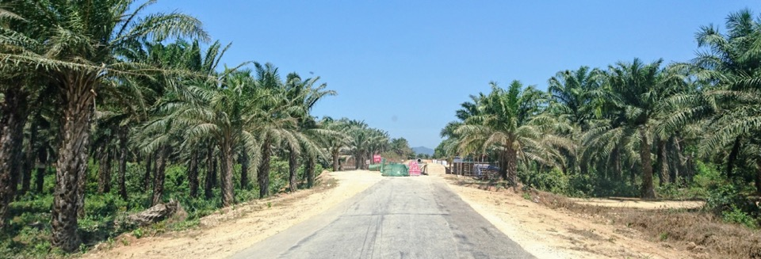
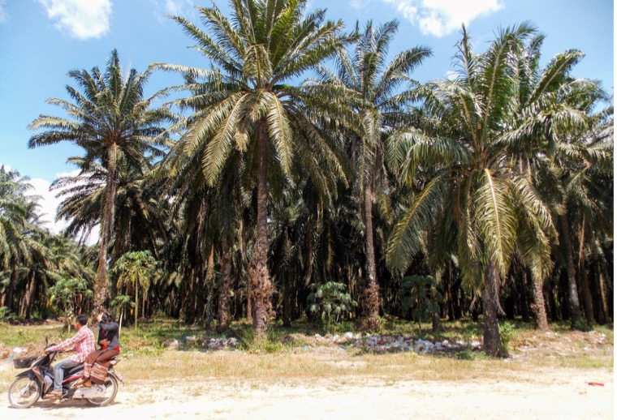
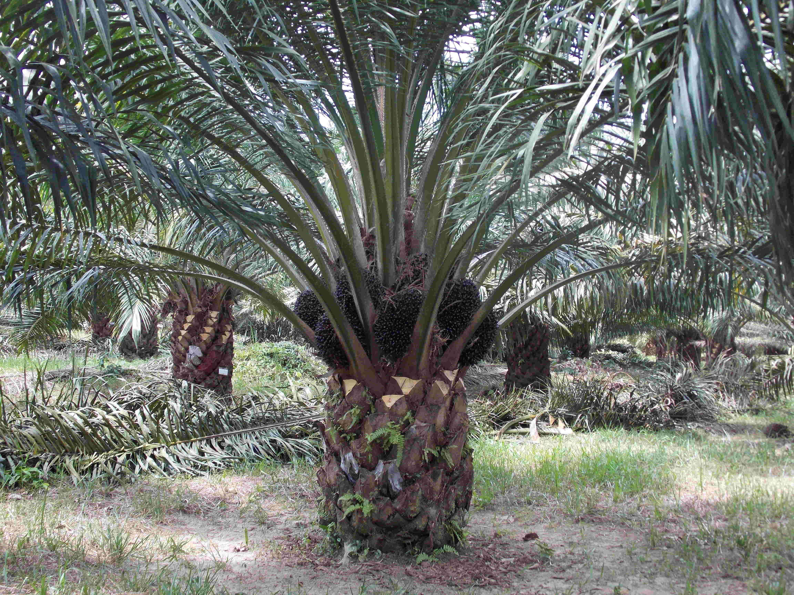
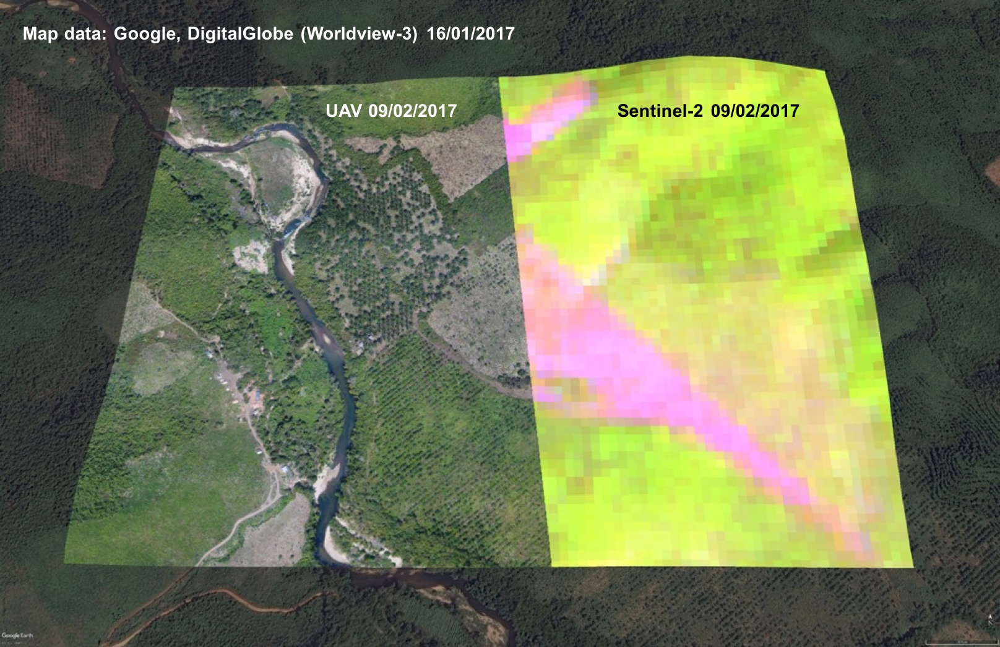
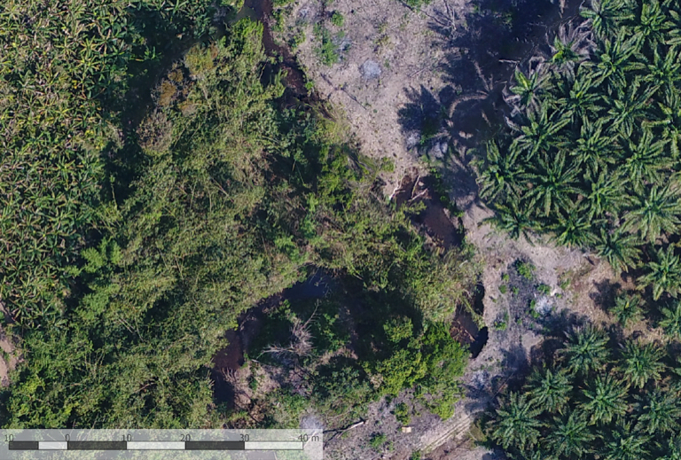
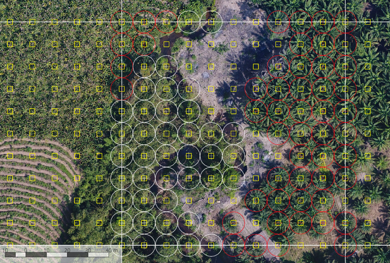
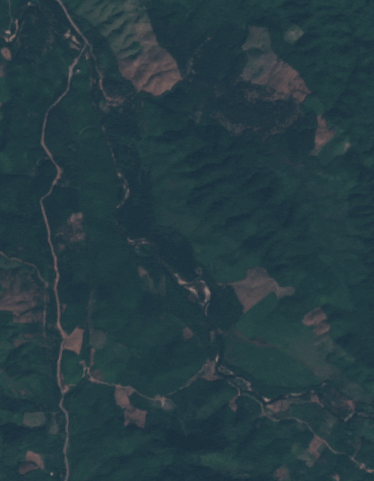
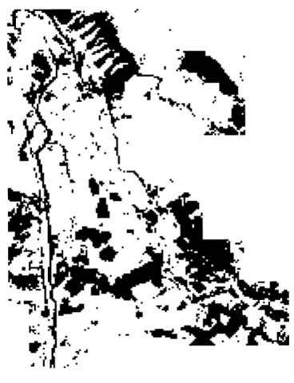

<h2>Oil palm in Myanmar</h2>

<h3>Land-Use Change, Forests, and Oil Palm Concessions in Southern Myanmar</h3>

Myanmar  had  the  third  largest  area  of  forest  loss  in  the  world  from  1990 to 2015,  with  the  forest  cover  declining  from  39.2  million  hectares  to 29  million  hectares  (FAO,  2015).  While  the  country  lacks  accurate  data  on deforestation,  forest  degradation  and  forest  carbon  stocks,  the  increase  of  agricultural  area  and  temporary  cropped  area  matches  the  forest  area  decline  of  about  7.7  million  ha between  1990 and  2011  (Raitzer  etal.,  2015).  Among  several  agribusiness  concessions,  oil  palm  plantations  have  increased  by 900%  since  2000.  These  are  located  in the  Tanintharyi  Region  of  Southern  Myanmar.  As of 2015,  402,000  hectares  have  been allocated  for  oil  palm  development,  of  which  less  than  40%  has so  far  been  planted  (Baskett,  2016). 

<table cellspacing="2" cellpadding="2" border="0">
<tr>
<td>

</td>
<td>

</td>
</tr>
<tr>
<td><em>
Mature palm oil trees
</em></td>
<td><em>
Myanmar seed (early stage)
</em></td>
</tr>
</table>

In March 2018, the Myanmar government announced a plan to revoke unplanted areas of oil palm concessions owned by several companies. Most of them are owned by foreign
companies and have conflicts with villagers. Could concession areas with conflicts with villagers, elephants and the forest department prevent clearance?

<h3>Methods

</h3>

<em>Example of the features visible at different resolutions: individual palm oil trees can be easily distinguished in the UAV data, but their presence in the Sentinel-2 data can only be inferred based on spectral and temporal characteristics of a dense time series of data.</em>

Optical data from unmanned aerial vehicles (UAVs) and Worldview-3 are used to assess the canopy cover and deforestation in and around several oil palm plantations from 2017 to 2018. These data can identify even young palm trees, and therefore allows an assessment of degradation rates in all different land use types in the area. These then provide the basic data that can be used in combination with other spatial representation of drivers (e.g. distance to roads) to identify the characteristics of the area and its drivers of tree loss. The percentage of canopy cover and the expansion of plantations are derived by generating random 100x100m grids and summing which of the 121 points within the grid have trees present. In the figure below on the right, palm trees are circled in red and other trees are in white.

<table cellspacing="2" cellpadding="2" border="0">
<tr>
<td></td>
<td> </td>
<td><em>UAV images and dot method</em></td>
</table>

The UAV and Worldview data are only available for a small portion of the total study area, and for limited points in time. In order to test hypotheses across the region, so I use the optical data from the UAV to train an algorithm to map palm and tree coverage using Sentinel-2 satellite data (10-20 m resolution). Such Sentinel-2 data is collected every 5 days across the whole region. The algorithm uses a statistical classifier, Random Forest (RF), with 50% of the grids shown in the two figures above used for training, and the remaining 50 % to test the accuracy of the algorithm. The Sentinel-2 data from multiple dates are combined into dense multi-temporal stacks, incorporating the whole annual seasonal cycle, in order to maximise its ability to differentiate between these different vegetation types.

<h3>Land cover and land use change

</h3>
<table cellspacing="2" cellpadding="2" border="0" summary="">
<tr>
<td></td>
<td></td>
</tr>
<tr>
<td><em>Sentinel-2 monthly median composites (2015-2018)</em></td>
<td><em>Bare land (black) change from 2017 to 2018</em></td>
</tr>
</table>
<h3>References
</h3>

Baskett,  J.  P.  C.  (2016).  Myanmar  oil  palm  plantations:  A  productivity  and  sustainability  review.  Fauna  &  Flora  International.  

FAO  (2015).  Global  Forest  Resources  Assessment  2015.  How  have  the  world's  forests  changed?  Rome,  Italy.  

Raitzer,  D.,  Samson,  J.  N.,  &  Nam,  K.  Y.  (2015).  Achieving  Environmental  Sustainability  in  Myanmar.  Asian  Development  Bank  Economics  Working  Paper  Series,  (467).

