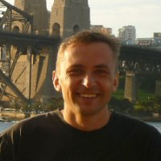
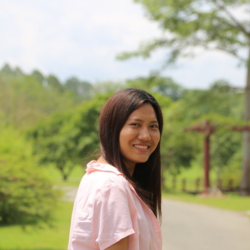

<!-- Global site tag (gtag.js) - Google Analytics -->

### People I worked with and learned from 
<table cellspacing="2" cellpadding="2" border="0">
<tr>
<td>

</td>
</tr>
<tr>
  <td><em>
<a href="https://www.geos.ed.ac.uk/homes/emitchar">Dr Edward Mitchard</a>
</em></td>
</tr>
</table>

<table cellspacing="2" cellpadding="2" border="0">
<tr>
<td>

</td>
</tr>
<tr>
<td><em>
<a href="https://www.research.ed.ac.uk/portal/en/persons/genevieve-patenaude(2e4ec6cd-5b23-4a94-a913-9be4c828428e).html">Dr Genevieve Patenaude</a>
</em></td>
</tr>
</table>

<table cellspacing="2" cellpadding="2" border="0">
<tr>
<td>

</td>
</tr>
<tr>
  <td><em>
<a href="https://sambowers.bitbucket.io/">Dr Samuel Bowers</a>
</em></td>
</tr>
</table>

<table cellspacing="2" cellpadding="2" border="0">
<tr>
<td>

</td>
</tr>
<tr>
<td><em>
<a href="https://geog.umd.edu/facultyprofile/hansen/matthew-c.">Dr Matthew Hansen</a>
</em></td>
</tr>
</table>

<table cellspacing="2" cellpadding="2" border="0">
<tr>
<td>

</td>
</tr>
<tr>
  <td><em>
<a href="https://www.geos.ed.ac.uk/homes/ihw/">Prof Iain Woodhouse</a>
</em></td>
</tr>
</table>

<table cellspacing="2" cellpadding="2" border="0">
<tr>
<td>

</td>
</tr>
<tr>
  <td><em>
<a href="https://www.researchgate.net/profile/Patrick_Oswald3">Patrick Oswald</a>
</em></td>
</tr>
</table>

<table cellspacing="2" cellpadding="2" border="0">
<tr>
<td>

</td>
</tr>
<tr>
  <td><em>
<a href="https://www.linkedin.com/in/thazin-nwe-76059a122/">Thazin Nwe</a>
</em></td>
</tr>
</table>

## And my friends who supported and celebrated with me 😭😍🎓
<blockquote class="twitter-tweet">
After enormous amounts of snacks and Indian takeway, <a href="https://twitter.com/hashtag/PhD?src=hash&amp;ref_src=twsrc%5Etfw">#PhD</a> <a href="https://twitter.com/hashtag/Thesis?src=hash&amp;ref_src=twsrc%5Etfw">#Thesis</a> submitted! Thank you everyone! <a href="https://t.co/0HL69QBk4o">pic.twitter.com/0HL69QBk4o</a>
&mdash; Keiko (@Keiko_geo) <a href="https://twitter.com/Keiko_geo/status/1154735249559052288?ref_src=twsrc%5Etfw">July 26, 2019</a></blockquote> 

<blockquote class="twitter-tweet">
Post viva photo! Very honoured to have examiners like ⁦<a href="https://twitter.com/fortiain?ref_src=twsrc%5Etfw">@fortiain</a>⁩ and Dr Ziv! With my amazing supervisor ⁦<a href="https://twitter.com/EdMitchard?ref_src=twsrc%5Etfw">@EdMitchard</a>⁩ and dear friends! Thank you all! <a href="https://t.co/5BIY1TpR03">pic.twitter.com/5BIY1TpR03</a>
&mdash; Keiko (@Keiko_geo) <a href="https://twitter.com/Keiko_geo/status/1171497419046998019?ref_src=twsrc%5Etfw">September 10, 2019</a></blockquote> 
