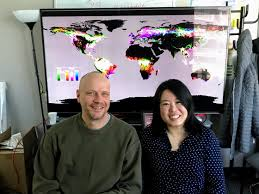

<!-- Global site tag (gtag.js) - Google Analytics -->

### People I worked with and learned from 

<em>
Dr Edward Mitchard
</em>

<em>
Dr Genevieve Patenaude
</em>

<em>
Dr Sam Bowers
</em>

<em>
Dr Matthew Hansen
</em>

<table cellspacing="2" cellpadding="2" border="0">
<tr>
<td>

</td>
</tr>
<tr>
<td><em>
Dr Edward Mitchard
</em></td>
</tr>
</table>
