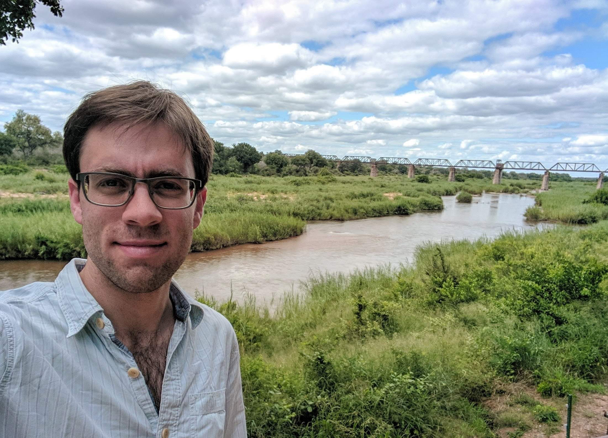

<!-- Global site tag (gtag.js) - Google Analytics -->

### People I worked with and learned from 
<table cellspacing="2" cellpadding="2" border="0">
<tr>
<td>

</td>
</tr>
<tr>
  <td><em>
<a href="https://www.geos.ed.ac.uk/homes/emitchar">Dr Edward Mitchard</a>
</em></td>
</tr>
</table>

<table cellspacing="2" cellpadding="2" border="0">
<tr>
<td>

</td>
</tr>
<tr>
<td><em>
<a href="https://www.research.ed.ac.uk/portal/en/persons/genevieve-patenaude(2e4ec6cd-5b23-4a94-a913-9be4c828428e).html">Dr Genevieve Patenaude</a>
</em></td>
</tr>
</table>

<table cellspacing="2" cellpadding="2" border="0">
<tr>
<td>

</td>
</tr>
<tr>
  <td><em>
<a href="https://sambowers.bitbucket.io/">Dr Samuel Bowers</a>
</em></td>
</tr>
</table>

<table cellspacing="2" cellpadding="2" border="0">
<tr>
<td>

</td>
</tr>
<tr>
<td><em>
<a href="https://geog.umd.edu/facultyprofile/hansen/matthew-c.">Dr Matthew Hansen</a>
</em></td>
</tr>
</table>

<table cellspacing="2" cellpadding="2" border="0">
<tr>
<td>

</td>
</tr>
<tr>
  <td><em>
<a href="https://www.geos.ed.ac.uk/homes/ihw/">Prof Iain Woodhouse</a>
</em></td>
</tr>
</table>
